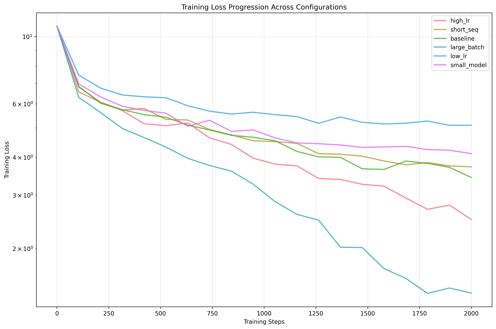
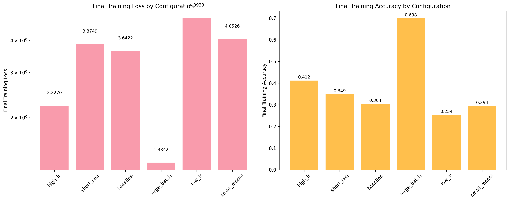
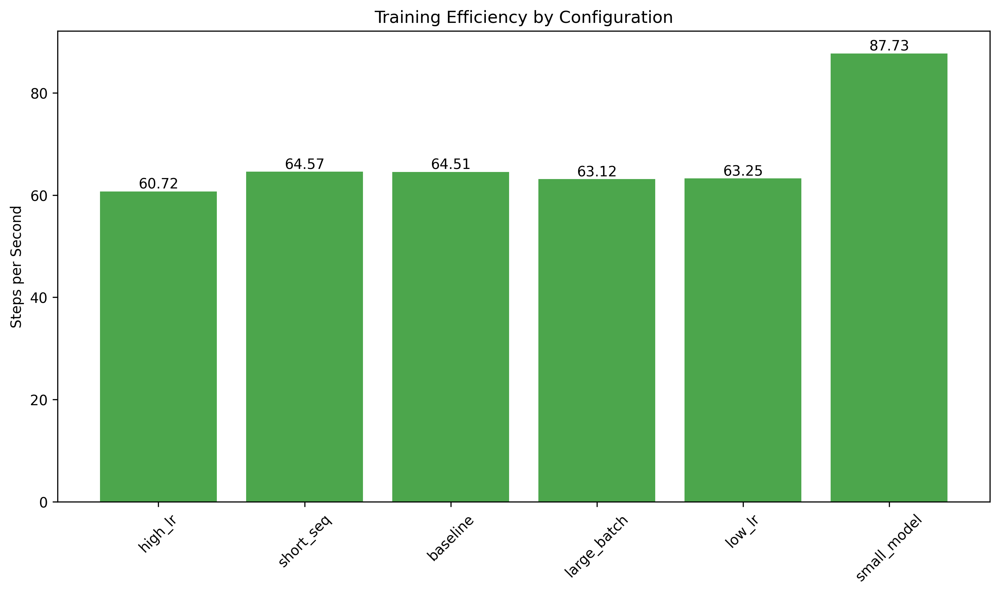
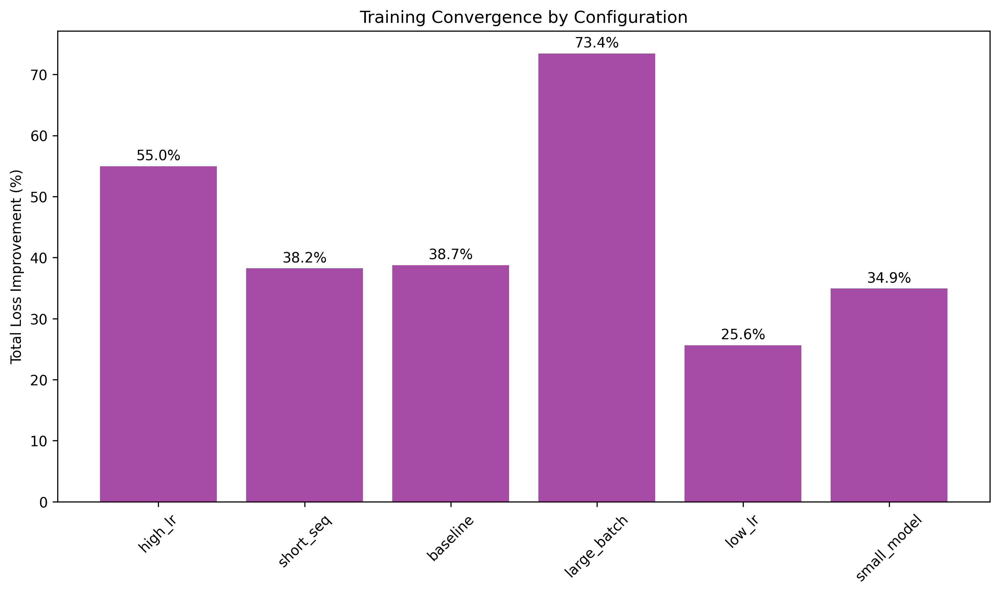

# Rapid Optimization of Small Transformers: 15-Minute Pretraining Ablations

English[中文版本] | (README_zh.md) 

Run the experiments yourself: **[Colab Notebook](https://colab.research.google.com/drive/1Fn5Dw-8xKKSt915dwNvqLwA7V0Bdw0IY?usp=sharing)**

## Overview

This repository contains a comprehensive ablation study of small-scale autoregressive Transformer language models, investigating the impact of key hyperparameters and architectural choices on training efficiency and performance in resource-constrained settings. We systematically evaluate six configurations across multiple dimensions: learning rate (1e-4 to 1e-3), batch size (8 to 16), sequence length (256 to 512), and model size (256 to 384 dimensions). Training was conducted on the SmolLM corpus using Tesla T4 GPU with mixed-precision training over 2000 steps (approximately 15 minutes per configuration).

## 🚀 Key Findings

- **Batch size scaling is crucial**: Large batch configurations achieve 2.7× better performance (training loss 1.334 vs 3.642 baseline)
- **Learning rate sensitivity is extreme**: Poor learning rates lead to 36× higher perplexity (178.18 vs 4.93)
- **Efficiency trade-offs exist**: Smaller models provide 39% faster training (87.7 vs 63.1 steps/second)
- **Short training reveals insights**: Meaningful results obtained in just 15 minutes per configuration
- **Data exposure matters**: Large batch configuration processes 2× more tokens, but achieves more than 2× improvement in loss

## 📊 Experimental Results

| Configuration | Train Loss | Accuracy | Perplexity | Steps/Second |
|---------------|------------|----------|------------|--------------|
| Large Batch   | **1.334**  | **69.8%** | **4.93**   | 63.12        |
| High LR       | 2.227      | 41.2%    | 18.82      | 60.72        |
| Baseline      | 3.642      | 30.4%    | 48.85      | 64.51        |
| Short Seq     | 3.875      | 34.9%    | 43.69      | 64.57        |
| Small Model   | 4.053      | 29.4%    | 77.25      | **87.73**    |
| Low LR        | 4.893      | 25.4%    | 178.18     | 63.25        |

## 🔧 Quick Start

Done in **[Google Colab](https://colab.research.google.com/drive/1Fn5Dw-8xKKSt915dwNvqLwA7V0Bdw0IY?usp=sharing)**

If you are unable to access it, download it from [here](https://github.com/vukrosic/do-small-llm-research/blob/main/15min_llm_ablations.ipynb)

## 📈 Configurations Tested

### 1. Baseline Configuration
- **Model**: 384d, 6 heads, 12 layers
- **Training**: Batch size 8, LR 3e-4, 512 seq length
- **Purpose**: Standard reference configuration

### 2. High Learning Rate
- **Modification**: Learning rate 1e-3 (batch size 8, 512 seq length)
- **Result**: Fast convergence, some instability (loss: 2.227)
- **Insight**: Aggressive learning rates work for short training

### 3. Low Learning Rate
- **Modification**: Learning rate 1e-4 (batch size 8, 512 seq length)
- **Result**: Poor convergence within 15 minutes (loss: 4.893)
- **Insight**: Conservative rates insufficient for rapid prototyping

### 4. Large Batch
- **Modification**: Batch size 16, scaled LR 5e-4 (512 seq length)
- **Result**: Best overall performance (loss: 1.334, 69.8% accuracy)
- **Insight**: Batch scaling crucial for optimization stability

### 5. Short Sequence
- **Modification**: Sequence length 256, batch size 12, LR 3e-4
- **Result**: Faster training, reduced performance (loss: 3.875)
- **Insight**: Context length vs. efficiency trade-off

### 6. Small Model
- **Modification**: 256d, 4 heads, 8 layers, batch size 12, LR 3e-4
- **Result**: Fastest training (87.7 steps/sec), moderate performance (loss: 4.053)
- **Insight**: Excellent for rapid iteration

## 🎯 Use Cases

### Research & Development
- **Rapid prototyping**: Test ideas in 15 minutes
- **Hyperparameter exploration**: Quick iteration cycles
- **Architecture comparison**: Efficient model selection

### Educational
- **Learning Transformers**: Hands-on experimentation
- **Understanding optimization**: Visualize training dynamics
- **Resource-constrained learning**: Accessible to all students

### Production
- **Model selection**: Choose optimal configurations
- **Resource planning**: Understand compute requirements
- **Baseline establishment**: Starting point for larger experiments

## 📊 Advanced Analysis

### Performance per Data Exposure
Our analysis reveals important insights when controlling for data exposure:

| Configuration | Total Tokens (M) | Loss/Token Efficiency |
|---------------|------------------|-----------------------|
| Large Batch   | 16.38           | **0.0815**            |
| High LR       | 8.19            | 0.2719                |
| Small Model   | 12.29           | 0.3298                |
| Baseline      | 8.19            | 0.4446                |
| Short Seq     | 6.14            | 0.6309                |
| Low LR        | 8.19            | 0.5975                |

### Confidence and Calibration Analysis
The best-performing models show superior prediction confidence:

- **Large Batch**: 0.502 confidence, lowest entropy (well-calibrated)
- **High LR**: 0.345 confidence, stable progression
- **Low LR**: 0.217 confidence, highest entropy (poorly calibrated)

### Top-5 Accuracy Results

| Configuration | Top-5 Accuracy | Top-1 Gap | Improvement |
|---------------|----------------|-----------|-------------|
| Large Batch   | **87.6%**      | 17.8%     | **86.1%**   |
| High LR       | 65.9%          | 24.7%     | 64.3%       |
| Baseline      | 53.6%          | 23.2%     | 52.3%       |
| Short Seq     | 55.1%          | 20.2%     | 53.7%       |
| Small Model   | 49.1%          | 19.7%     | 47.4%       |
| Low LR        | 41.7%          | 16.3%     | 40.1%       |

## 📊 Visualization Examples

The repository includes comprehensive visualizations:



- **Training Loss Curves**: Compare convergence patterns across configurations
- **Performance Metrics**: Final accuracy, perplexity comparisons
  
- **Efficiency Analysis**: Steps/second, training time trade-offs
  
- **Convergence Analysis**: Early vs. late phase dynamics
  

## 🔬 Research Methodology

### Model Architecture
- **Type**: Decoder-only autoregressive Transformer
- **Attention**: Multi-head attention with Rotary Position Embedding (RoPE)
- **Activation**: SiLU (Swish) for enhanced gradient flow
- **Normalization**: RMSNorm for training stability
- **Feed-Forward**: Standard FFN with configurable dimensions

### Dataset
- **Source**: HuggingFaceTB/smollm-corpus (cosmopedia-v2)
- **Size**: 500 documents
- **Tokenizer**: HuggingFaceTB/SmolLM-135M

### Training Setup
- **Hardware**: NVIDIA Tesla T4 GPU
- **Duration**: 2000 steps (~15 minutes per config)
- **Evaluation**: Every 400 steps
- **Precision**: Automatic Mixed Precision (AMP)
- **Optimizer**: AdamW (weight decay 0.1, β₁=0.9, β₂=0.95)
- **Scheduler**: Cosine annealing with warmup

### Metrics Tracked
- Training/validation loss and accuracy
- Perplexity and confidence scores
- Top-5 accuracy and calibration metrics
- Training efficiency (steps/second)
- Gradient norms and convergence patterns

## ⚠️ Limitations and Considerations

### Methodological Limitations
- **Short training duration**: Limited to 2000 steps may not capture long-term behavior
- **Single-run experiments**: No statistical significance testing or variance estimation
- **Uncontrolled data exposure**: Different batch sizes process varying amounts of data
- **Single dataset**: Testing only on SmolLM corpus limits generalizability
- **Hardware constraints**: Tesla T4 results may not reflect other architectures

### Critical Analysis
- **Data exposure confounding**: Large batch's superior performance partially due to processing 2× more tokens
- **Training duration bias**: May favor fast-converging configurations
- **Hardware specificity**: Results specific to T4 GPU memory and compute characteristics

## 🚀 Future Research Directions

### Immediate Extensions
1. **Controlled Data Exposure**: Fixed token budgets across configurations
2. **Statistical Validation**: Multiple runs with different seeds
3. **Extended Training**: 10K+ steps for long-term convergence
4. **Cross-Dataset Validation**: Multiple domain evaluation

### Advanced Studies
1. **Learning Rate Schedules**: Warmup strategies, cyclical rates
2. **Regularization Effects**: Dropout variations, weight decay scaling
3. **Architecture Variants**: Mixture of Experts, sparse attention
4. **Scaling Laws**: Performance scaling with model size, data, and compute
5. **Multi-GPU Analysis**: Distributed training patterns

### Methodological Improvements
1. **Fair Comparison Protocols**: Standardized evaluation accounting for compute budgets
2. **Uncertainty Quantification**: Bayesian approaches to model uncertainty
3. **Hardware Generalization**: Cross-platform validation

## 📝 Citation

If you use this work in your research, please cite:

```bibtex
@article{rosic2025transformer_ablation,
  title={Rapid Optimization of Small-Scale Transformer Language Models: 15-Minute Pretraining Ablations on Learning Rates, Batch Sizes, and Architectural Efficiency in Resource-Constrained Settings},
  author={Rosić, Vuk and Claude},
  journal={arXiv preprint},
  year={2025}
}
```

## 🤝 Contributing

We welcome contributions! Please see our contributing guidelines:

1. Fork the repository
2. Create a feature branch
3. Add your experiments or improvements
4. Submit a pull request with detailed description

### Areas for Contribution
- New configuration experiments
- Additional visualization tools
- Performance optimizations
- Documentation improvements

## 📄 License

This project is licensed under the MIT License - see the [LICENSE](LICENSE) file for details.

## 🙏 Acknowledgments

- **HuggingFace**: For the SmolLM corpus and transformers library
- **PyTorch Team**: For the excellent deep learning framework
- **Google Colab**: For providing accessible GPU resources
- **Research Community**: For open science and reproducible research

## 📞 Contact

- **Author**: Vuk Rosić
- **Email**: vukrosic1@gmail.com
- **Institution**: Óbuda University

---

**⭐ Star this repository if you find it useful for your research!**