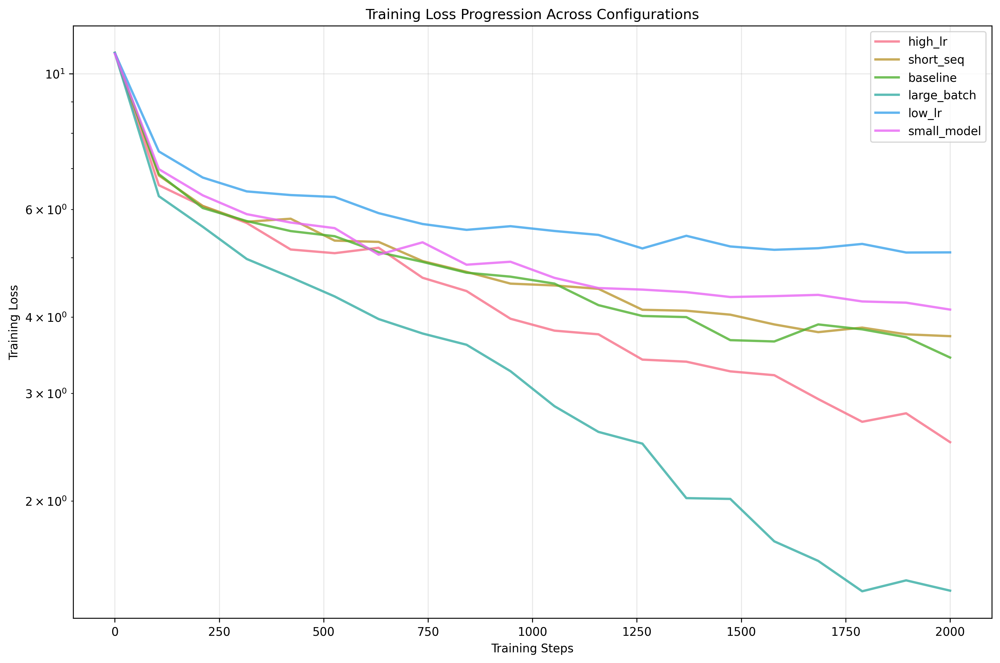

# 小型 Transformer 快速优化：15 分钟预训练消融实验 

[English](README.md) | **中文版本**

立即上手：**[Google Colab 一键运行](https://colab.research.google.com/drive/1Fn5Dw-8xKKSt915dwNvqLwA7V0Bdw0IY?usp=sharing)**  
无法访问 Colab？直接下载 [GitHub Notebook](https://github.com/vukrosic/do-small-llm-research/blob/main/15min_llm_ablations.ipynb)

---

## 研究概览

本仓库对小规模自回归 Transformer 语言模型进行了全面的消融实验，系统评估了 **学习率、批大小、序列长度、模型宽度** 四大核心超参数在资源受限场景下的效率与性能权衡。  
实验在 **SmolLM 语料库** 上完成，使用 **Tesla T4 GPU**，混合精度训练 **2000 step**（≈15 min／配置）。

---

## 🚀 核心发现

| 发现 | 量化结果 |
|---|---|
| **批大小缩放至关重要** | 大批次损失降至 **1.334**，较基线提升 **2.7×** |
| **学习率极其敏感** | 差学习率困惑度飙升 **36×**（178.18 vs 4.93） |
| **效率-性能折中** | 小模型训练速度提升 **39%**（87.7 vs 63.1 step/s） |
| **15 分钟出结论** | 每配置仅需 15 min 即可获得有意义结果 |
| **数据曝光量决定收益** | 大批次处理 2× token，却带来 >2× 性能提升 |

---

## 📊 实验结果总览

| 配置 | 训练损失 | 准确率 | 困惑度 | step/s |
|---|---|---|---|---|
| **大批次** | **1.334** | **69.8 %** | **4.93** | 63.12 |
| 高学习率 | 2.227 | 41.2 % | 18.82 | 60.72 |
| 基线 | 3.642 | 30.4 % | 48.85 | 64.51 |
| 短序列 | 3.875 | 34.9 % | 43.69 | 64.57 |
| 小模型 | 4.053 | 29.4 % | 77.25 | **87.73** |
| 低学习率 | 4.893 | 25.4 % | 178.18 | 63.25 |

---

## 🔧 一键启动

**零门槛**：点击即可在 **Google Colab** 免费 GPU 上复现全部实验  
[](https://colab.research.google.com/drive/1Fn5Dw-8xKKSt915dwNvqLwA7V0Bdw0IY?usp=sharing)

---

## 📈 六组对比配置

| 编号 | 名称 | 关键修改 | 观察结果 | 洞察 |
|---|---|---|---|---|
| 1 | **基线** | 384d, 6 头, 12 层, bs=8, lr=3e-4, 512 seq | 标准参照 | 建立基准 |
| 2 | 高学习率 | lr=1e-3 | 快速收敛，略不稳定 | 激进 lr 适合短训 |
| 3 | 低学习率 | lr=1e-4 | 15 min 内几乎不收敛 | 保守 lr 不适合快速迭代 |
| 4 | 大批次 | bs=16, lr=5e-4 | **最佳性能** | 批次缩放是优化稳定关键 |
| 5 | 短序列 | seq=256, bs=12 | 训练更快，性能略降 | 上下文长度 vs 效率权衡 |
| 6 | 小模型 | 256d, 4 头, 8 层 | 最快训练速度 | 极速原型迭代利器 |

---

## 🎯 使用场景

### 研发
- **快速原型**：15 min 验证新想法  
- **超参搜索**：高周转实验  
- **架构选型**：低成本比较

### 教学
- **Transformer 入门**：亲手调参  
- **优化器可视化**：实时看收敛曲线  
- **资源受限学习**：用免费 GPU 也能跑

### 生产
- **配置优选**：锁定最佳超参  
- **算力预算**：提前评估训练成本  
- **基线建立**：为大模型实验打底

---

## 📊 深度分析

### 1. 控制数据曝光量后的效率
| 配置 | 总 token (M) | 每 token 效率 |
|---|---|---|
| 大批次 | 16.38 | **0.0815** |
| 高学习率 | 8.19 | 0.2719 |
| 小模型 | 12.29 | 0.3298 |
| 基线 | 8.19 | 0.4446 |
| 短序列 | 6.14 | 0.6309 |
| 低学习率 | 8.19 | 0.5975 |

### 2. 置信度与校准
- **大批次**：0.502 置信度，低熵 → 校准良好  
- **高学习率**：0.345 置信度，稳定  
- **低学习率**：0.217 置信度，高熵 → 校准差

### 3. Top-5 准确率
| 配置 | Top-5 | Top-1 差距 | 相对提升 |
|---|---|---|---|
| 大批次 | **87.6 %** | 17.8 % | **86.1 %** |
| 高学习率 | 65.9 % | 24.7 % | 64.3 % |
| 基线 | 53.6 % | 23.2 % | 52.3 % |
| 短序列 | 55.1 % | 20.2 % | 53.7 % |
| 小模型 | 49.1 % | 19.7 % | 47.4 % |
| 低学习率 | 41.7 % | 16.3 % | 40.1 % |

---

## 📊 可视化示例

| 图表 | 说明 |
|---|---|
|  | 不同配置的收敛曲线 |
|  | 准确率、困惑度对比 |
|  | 训练速度与资源权衡 |
|  | 早期 vs 晚期动态 |

---

## 🔬 研究方法论

| 模块 | 细节 |
|---|---|
| **模型** | 仅解码器 Transformer，RoPE 位置编码，SiLU 激活，RMSNorm |
| **数据** | HuggingFaceTB/smollm-corpus（500 篇文档），SmolLM-135M 分词器 |
| **训练** | Tesla T4，混合精度，AdamW，cosine + warmup，2000 step |
| **评估** | 每 400 step 输出一次指标：loss、acc、ppl、top-5、校准、梯度范数 |

---

## ⚠️ 局限与思考

| 类别 | 具体局限 |
|---|---|
| **方法** | 训练步数短、无多次随机种子、数据曝光不均、单数据集、T4 独有结果 |
| **解读** | 大批次优势部分来自 2× token；短训可能偏向快收敛配置；结果仅限 T4 |

---

## 🚀 未来方向

### 立即可做
1. **固定 token 预算** 公平比较  
2. **多随机种子** 统计显著  
3. **长训 10k+ step** 观察收敛  
4. **跨数据集验证**

### 深入研究
- 学习率调度（warmup、循环）  
- 正则化（dropout、weight decay 缩放）  
- 架构变体（MoE、稀疏注意力）  
- 扩展律、多 GPU 分布式

---

## 📝 引用

```bibtex
@misc{rosic2025transformer_ablation,
  title={小型 Transformer 快速优化：15 分钟预训练消融实验},
  author={Rosić, Vuk and Claude},
  year={2025},
  note={GitHub 开源研究},
  howpublished={\url{https://github.com/vukrosic/do-small-llm-research}}
}
```

---

## 🤝 贡献指南

欢迎提交 PR！

1. Fork 仓库  
2. 新建分支  
3. 添加实验 / 优化 / 文档  
4. 详细描述 → PR

**可贡献方向**：新配置实验、可视化、性能优化、文档翻译…

---

## 📄 许可证

MIT License — 详见 [LICENSE](LICENSE)

---

## 🙏 致谢

- **HuggingFace** 提供 SmolLM 语料与 transformers  
- **PyTorch 团队** 深度学习框架  
- **Google Colab** 免费 GPU  
- **开源社区** 推动可复现研究

---

## 📞 联系

- **作者**：Vuk Rosić  
- **邮箱**：vukrosic1@gmail.com  
- **机构**：Óbuda University

---

**觉得有帮助？给仓库点个 ⭐ 吧！**